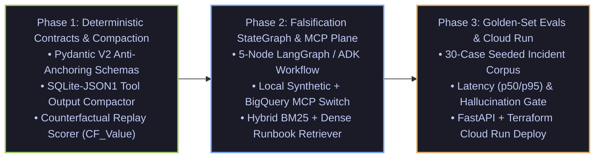

# Mario Hu (`@mariohu-fde`)

**AI Systems & Cloud Solutions Engineer | Data & AI @ Google Cloud**

I build the deterministic control planes, context harnesses, and evaluation gates around foundation models—keeping agent execution inspectable, tool outputs bounded, and root-cause hypotheses falsifiable.

---

## Three Places to Start

### 1. `cloudops-autonomous-agent`: Falsification-First RCA & Zero-Bloat Telemetry Harness

A 50,000-token Cloud Logging or BigQuery `INFORMATION_SCHEMA` dump should not consume the context window needed to diagnose an outage, and an RCA agent should not anchor on the first plausible error signature.

`cloudops-autonomous-agent` enforces a **Deterministic Control & Compaction Plane** around Google Cloud diagnostic workflows:
- **Anti-Anchoring Hypothesis Contracts (`Pydantic V2`)**: Explicitly tracks `DisprovenDeadEnd` records alongside active hypotheses and injects an `ANTI-ANCHORING MANDATE` into the system prompt so the agent cannot re-probe falsified paths.
- **Zero-Bloat Tool Compactor (`AfterToolCallback` + `SQLite-JSON1`)**: Intercepts oversized JSON tool outputs (`>1,500 chars`), offloads full payloads into an indexed in-memory SQLite `json_each` store, and returns a bounded `<400-token` structural digest with a `payload_ref` handle.
- **Counterfactual Trajectory Replay (`CF_Value` + `<=120` Line Constitutional Gate)**: Scores historical execution traces before promoting failure patterns into long-term agent memory.

**First proof:** Run `pytest -v` locally with zero cloud credentials required. Inspect how a 500-row telemetry dump is compacted into a deterministic digest + SQLite query handle, and how `DisprovenDeadEnd` blocks repeat tool calls.

[Repository & Quickstart](https://github.com/mariohu-fde/cloudops-autonomous-agent) · [Incident & Dead-End Contracts](https://github.com/mariohu-fde/cloudops-autonomous-agent/blob/main/schemas/incident.py) · [SQLite-JSON1 Compactor](https://github.com/mariohu-fde/cloudops-autonomous-agent/blob/main/middleware/tool_compactor.py)

---

### 2. `agentic-systems-radar`: Frontier Agent Research Distillations & Systems ADRs

Generic paper summaries do not survive production contact. `agentic-systems-radar` translates daily frontier `arXiv` agentic systems papers (`Dream-RSI`, `RRSI`, `RetireOPD`, `SWE-Router`, `RepoMAS`, `GraMRAG`) into concrete **Architecture Decision Records (ADRs)** and explicit **Adoption / RejectionVerdicts**.

**First proof:** Read `ADR-0001` (why we rejected raw context stuffing and LLM-based summarization in favor of deterministic `SQLite-JSON1` interception) and `ADR-0002` (why single-agent ReAct loops fail on multi-tenant cloud incidents without a `Falsify/Verify` state transition).

[Repository & Index](https://github.com/mariohu-fde/agentic-systems-radar) · [ADR-0001: Zero-Bloat Tool Compaction](https://github.com/mariohu-fde/agentic-systems-radar/blob/main/adrs/ADR-0001-sqlite-json1-tool-output-compaction.md) · [ADR-0002: Falsification-First RCA](https://github.com/mariohu-fde/agentic-systems-radar/blob/main/adrs/ADR-0002-falsification-first-rca-state-machine.md)

---

### 3. Field Forensics & Google Cloud AI Workarounds *(Incremental Rollout)*

Production enterprise deployments fail at integration seams—silent grounding drops, serving config mismatches, and slot contention bottlenecks. Drawing from daily Google Cloud Data & AI field engineering, these modules package reproducible workarounds and verification harnesses:
- **Vertex AI Search & Gemini Enterprise (`GE`) Grounding Diagnostics**: Reproducing and mitigating silent retrieval/grounding failures, `servingConfigId` routing traps, and cold-start ranking degradation.
- **BigQuery Execution & Memory Hierarchy Forensics**: Deterministic `INFORMATION_SCHEMA` triage playbooks separating `Wait_on_slot_availability` scheduler queuing from shuffle-memory spill bottlenecks.

---

## Find the System for Your Problem

| You need to… | Start with | Evaluate first |
| :--- | :--- | :--- |
| Prevent an RCA agent from re-probing falsified root causes | [`cloudops-autonomous-agent/schemas`](https://github.com/mariohu-fde/cloudops-autonomous-agent/blob/main/schemas/incident.py) | `DisprovenDeadEnd` & `to_anti_anchoring_prompt_block()` |
| Keep 50KB+ JSON tool logs out of the LLM context window | [`cloudops-autonomous-agent/middleware`](https://github.com/mariohu-fde/cloudops-autonomous-agent/blob/main/middleware/tool_compactor.py) | `SQLiteToolCompactor.after_tool_callback()` & `query_json_slice()` |
| Gate long-term agent memory against bloated prompt drift | [`cloudops-autonomous-agent/evals`](https://github.com/mariohu-fde/cloudops-autonomous-agent/blob/main/evals/replay_scorer.py) | `CounterfactualReplayScorer` & `MAX_CONSTITUTION_LINES = 120` |
| Evaluate why a frontier agent paper should be adopted or rejected | [`agentic-systems-radar/digests`](https://github.com/mariohu-fde/agentic-systems-radar/tree/main/digests) | Daily `2026-09-*` Systems Radar & Tradeoff Verdicts |
| Review architectural tradeoffs before writing orchestration code | [`agentic-systems-radar/adrs`](https://github.com/mariohu-fde/agentic-systems-radar/tree/main/adrs) | `ADR-0001` & `ADR-0002` |

---

## Incremental Engineering Roadmap

### Sprint Milestones

- [x] **M1.1**: Strongly-typed Incident & Negative-Knowledge Contracts (`DisprovenDeadEnd` & Anti-Anchoring Serializer in `Pydantic V2`)
- [x] **M1.2**: Zero-Bloat Tool Output Compactor (`AfterToolCallback` + `SQLite json_each` schemaless query engine)
- [x] **M1.3**: Stage 2.5 Counterfactual Trajectory Scorer (`CF_Value` & `<=120` Line Constitutional Consolidation Gate)
- [ ] **M2.1**: Dual-Mode Telemetry Data Plane (Local Synthetic Fixtures by default; `USE_GCP_LIVE=1` for Cloud Logging & BigQuery)
- [ ] **M2.2**: Hybrid Cloud Runbook Retriever (`BM25` + Dense Embeddings + Cross-Encoder Reranking)
- [ ] **M2.3**: 5-Node Falsification-First StateGraph (`Ingest ➔ Hypothesize ➔ Investigate ➔ Falsify/Verify ➔ Synthesize`)
- [ ] **M3.1**: 30-Case Golden Incident Benchmark Suite & LLM-as-a-Judge Trajectory Eval Report
- [ ] **M3.2**: Async FastAPI Service, OpenTelemetry Cloud Trace & Idempotent Terraform / Cloud Run Deployment

---

## Activity

---

## How I Judge the Work

Falsification before confirmation. Bounded digests before raw telemetry dumps. Negative knowledge (`DISPROVEN_DEAD_END`) preserved alongside positive playbooks. A small, local first run with zero external dependencies that makes the next architectural decision clear.
