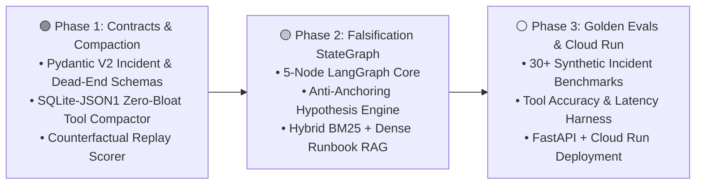

# 👋 Hi, I'm Mario Hu (`@mariohu-fde`)

**Technical Solutions Engineer (Data & AI) @ Google Cloud ➔ Forward Deployed AI Systems Engineer**

> Building production-grade **Autonomous Diagnostic Agents**, **Falsification-First LangGraph State Machines**, and **Self-Evolving Knowledge Harnesses** on Google Cloud (`Vertex AI`, `Gemini`, `BigQuery`, `Cloud Run`).

---

## 🏛️ Engineering Thesis

Most enterprise LLM agents fail in production not because the foundation model lacks reasoning capability, but because of **three systems-engineering bottlenecks**:

1. **Confirmation Bias & Hypothesis Anchoring**: Single-agent ReAct loops latch onto the first plausible error signature and hallucinate root causes when telemetry is ambiguous.
2. **Context Window Bloat (`Total Cost of Agency`)**: Unbounded raw JSON tool outputs (Cloud Logging dumps, MQL time-series, schema metadata) pollute attention, bust Prefix KV Caches, and degrade multi-step reasoning.
3. **Positive-Only Memory Drift**: Playbooks record *what worked once* while discarding **Negative Knowledge (`DISPROVEN_DEAD_END`)**—causing agents to repeatedly probe falsified hypotheses across incidents.

My engineering work focuses on solving these three bottlenecks through **contract-driven Python architectures** and **quantitative Golden Benchmark evaluations**.

---

## 🚀 Flagship Repositories

| Repository | Architecture & Scope | Tech Stack | Status |
| :--- | :--- | :--- | :--- |
| **[`cloudops-autonomous-agent`](https://github.com/mariohu-fde/cloudops-autonomous-agent)** | **Autonomous Cloud Root-Cause Analysis (RCA) & Remediation Agent** • 5-Node Falsification-First StateGraph • `DISPROVEN_DEAD_END` Anti-Anchoring Contracts • Zero-Bloat `SQLite-JSON1` Tool Output Compactor • Counterfactual Trajectory Replay (`CF_Value`) & `<=120` Line Constitutional Cap | `Python 3.12` · `Pydantic V2` · `LangGraph` · `Vertex AI SDK` · `FastAPI` · `SQLite-JSON1` | 🟢 **Active Sprint (Phase 1–2)** |
| **[`agentic-systems-radar`](https://github.com/mariohu-fde/agentic-systems-radar)** | **Production Agentic Systems Research Radar & ADRs** • Daily 15-minute distillation of frontier `arXiv` agent papers (`Dream-RSI`, `RRSI`, `RetireOPD`, `SWE-Router`, `RepoMAS`, `GraMRAG`) • Systems-level Architecture Decision Records (ADRs) | `Architecture` · `ADRs` · `Mermaid` · `Evals` | 🟢 **Updated Weekly** |

---

## 🗺️ 6-Month FDE Systems Engineering Roadmap

### Milestone Tracker (`15m Morning Radar + 45m Daily Code Sprint`)

- [x] **M1.1**: Strongly-typed Incident & Negative-Knowledge Contracts (`DisprovenDeadEnd` & Anti-Anchoring Serializer in `Pydantic V2`)
- [x] **M1.2**: Zero-Bloat Tool Output Compactor (`AfterToolCallback` + `SQLite json_each` schemaless query engine)
- [x] **M1.3**: Stage 2.5 Counterfactual Trajectory Scorer (`CF_Value` & `<=120` Line RRSI Consolidation Gate)
- [ ] **M2.1**: Vertex AI Structured Function Calling & Parallel Telemetry Dispatcher
- [ ] **M2.2**: Hybrid Cloud Runbook Retriever (`BM25` + Dense Embeddings + Cross-Encoder Reranking)
- [ ] **M2.3**: 5-Node Falsification-First LangGraph StateGraph (`Ingest ➔ Hypothesize ➔ Investigate ➔ Falsify/Verify ➔ Synthesize`)
- [ ] **M3.1**: 30-Case Golden Incident Benchmark Suite & Automated Regression CI
- [ ] **M3.2**: Async FastAPI Service & Idempotent Cloud Run / Terraform Deployment

---

## 🛠️ Core Technical Domains

- **Agentic Orchestration & Evals**: LangGraph (`StateGraph`), Vertex AI Agent Engine, Counterfactual Replay (`Dream-RSI`), Trajectory Verification, Context Compaction.
- **Retrieval & Search Systems**: Hybrid RAG (`BM25` + Dense Vector), Multimodal Graph RAG (`GraMRAG`), Vertex AI Search for Commerce, Neural Ranking & Cold-Start Mitigation.
- **Cloud & Data Infrastructure**: Google Cloud Platform (`GKE`, `Cloud Run`, `PSC`, `VPC-SC`), BigQuery Slot Execution & Memory Hierarchy, Cloud Logging / Monitoring Telemetry Forensics.
